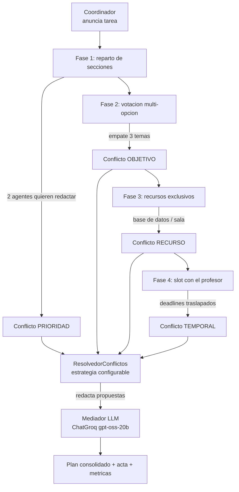

# Sistema de Colaboración Académica — actividad de décimas IL2.3

Prototipo reproducible de **coordinación y resolución de conflictos entre
múltiples agentes**, elegido como *Proyecto 4 (Sistema de Colaboración
Académica)* de la guía pedagógica de IL2.3 «Planificación y Orquestación»
(`Ingenieria-de-Soluciones-con-IA/RA2/IL2.3/0-guia-pedagica.md`).

Cuatro agentes-estudiantes —**Coordinador, Investigador, Analista y
Redactor**— deben producir un informe académico grupal. Para lograrlo se
reparten las secciones, votan el tema y compiten por recursos académicos
escasos (base de datos, sala de trabajo, revisión con el profesor). Los
conflictos emergen del escenario (no están guionizados) y se resuelven con
seis estrategias configurables: `prioridad`, `negociacion`, `arbitraje`,
`votacion`, `compromiso` y `primero_en_llegada`.

## Cómo ejecutar

Requisitos: Python 3.11+, `langchain-groq`, `python-dotenv` y `pytest`.
El proyecto se desarrolló con el intérprete del curso
(`ep1-ecoturismo-agente/.venv`, Python 3.13); cualquier entorno con esos
paquetes sirve:

```bash
pip install langchain-groq python-dotenv pytest      # o uv pip install ...

# 1) corrida completa con mediador LLM real (Groq, openai/gpt-oss-20b)
python main.py --estrategia negociacion --seed 42

# 2) las 6 estrategias con la misma semilla → tabla comparativa
python main.py --comparar

# 3) pruebas del protocolo (18 pruebas)
python -m pytest tests -q
```

> Comando exacto usado para la evidencia de este repositorio (Windows):
> `& "..\ep1-ecoturismo-agente\.venv\Scripts\python.exe" main.py --estrategia negociacion --seed 42`

El mediador LLM es **opcional**: con `--llm no` la corrida es determinista y
no consume red. La clave se lee de `.env` (`GROQ_API_KEY`, `GROQ_MODEL`);
ese archivo no se versiona (ver `.gitignore`). Sin clave o ante un error 429
el sistema cae al mediador determinista y la simulación sigue de pie.

## Arquitectura



| Módulo | Rol |
|---|---|
| `simulacion/coordinacion.py` | adaptación de `9-multi-agent-coordination.py`: mensajes, capacidades, votación multi-opción |
| `simulacion/conflictos.py` | adaptación de `10-conflict-resolution.py`: detección y 6 estrategias de resolución |
| `simulacion/agentes.py` | `Estudiante`: une ambos mundos (coordinación + recursos + deadline) |
| `simulacion/escenario.py` | las 4 fases de la tarea grupal y el plan consolidado |
| `simulacion/mediador_llm.py` | ChatGroq: redacta propuestas de negociación y el acta (rol acotado) |
| `main.py` | CLI: `--estrategia`, `--seed`, `--llm`, `--comparar` |
| `tests/` | 18 pruebas del protocolo (coordinación, conflictos, escenario, mediador) |
| `evidencia/` | transcripción y métricas por estrategia + tabla comparativa |

Mapeo de nombres base → proyecto: `MessageType/CoordinatedAgent/Coordinator`
→ `TipoMensaje/AgenteCoordinado/Coordinador`; `ConflictType/ResolutionStrategy/
ConflictResolver` → `TipoConflicto/EstrategiaResolucion/ResolvedorConflictos`.

## Decisiones de diseño (y errores de la guía que se evitan)

1. **No usar LLM para todo** (error #1). El reparto por capacidades y las
   seis estrategias de resolución son Python puro y determinista. El LLM solo
   *redacta* las propuestas de cada ronda de negociación y el acta final;
   quién gana cada conflicto lo fija el protocolo.
2. **Sí se justifica el multi-agente** (error #4). La actividad estudia
   precisamente coordinación y conflictos, y los conflictos son reales:
   dos agentes quieren redactar, dos piden la misma base de datos y dos
   necesitan el mismo slot de revisión. No hay agentes pasándose texto en
   línea sin propósito.
3. **Tope duro de iteraciones** (error #6). La negociación corre como máximo
   3 rondas (`MAX_RONDAS_NEGOCIACION`); al agotarse, arbitraje forzado. El
   acuerdo depende de la asimetría de deadlines: urgencia simétrica cierra en
   ronda 1, asimetría leve en ronda 2 y asimetría fuerte agota el tope.
4. **Medir tokens y segundos** (error #5). Cada corrida reporta mensajes,
   conflictos por tipo, rondas de negociación, llamadas y tokens del mediador
   y segundos totales. Ver `evidencia/corrida-negociacion-seed42.md`:
   corrida real con LLM = 15 llamadas, 3.954 tokens de entrada y 1.998 de
   salida, 7,9 s, 32 mensajes, 5/5 conflictos resueltos; el mismo escenario
   sin mediador corre en milisegundos con 0 tokens. (La temperatura 0.3 del
   mediador introduce una variación de ±10% entre corridas.)
5. **Reproducibilidad.** `--seed` fija el `random` que usa la votación (el
   archivo base usaba `random` global, por lo que sus corridas no eran
   reproducibles). Las políticas de los agentes son deterministas por rol.
6. **Extensiones sobre los archivos base.** `votacion_multiple` vota entre N
   opciones y detecta empates (el base solo votaba sí/no);
   `resolver_por_arbitraje` y `resolver_primero_en_llegar` están declarados
   en el enum del base pero sin implementación, aquí sí funcionan con
   criterio explícito (deadline más próximo / orden de llegada).
7. **Robustez.** Sin clave, sin red o ante 429, el mediador cae a un redactor
   determinista; la corrida se completa igual y el modo usado queda registrado
   en las métricas.

## Evidencia

`python main.py --comparar` (misma semilla, sin mediador, para aislar el
efecto de la estrategia):

| Estrategia | `acceso_base_datos` → | `revision_con_profesor` → | Rondas neg. | Segundos |
|---|---|---|---|---|
| prioridad | Analista | Analista | 0 | ~0.00 |
| negociacion | Analista | Investigador | 14 | ~0.00 |
| arbitraje | Analista | Investigador | 0 | ~0.00 |
| votacion | Investigador | Investigador | 0 | ~0.00 |
| compromiso | compartido | compartido | 0 | ~0.01 |
| primero_en_llegada | Investigador | Investigador | 0 | ~0.00 |

Lectura: el escenario es idéntico en todas las corridas (32-33 mensajes,
5 conflictos, 5 resueltos); lo que cambia es **a quién** se asigna cada
recurso y **cuánto** cuesta la decisión. La negociación es la única
estrategia que gasta rondas y la única que puede repartir el acceso cuando
los deadlines son asimétricos; la votación asigna según el sorteo con
semilla, no según el mérito de cada parte. La corrida con LLM real documenta
el costo: 7,9 s y ~6.000 tokens por corrida completa, frente a milisegundos
del protocolo puro.

Archivos en `evidencia/`: una transcripción por estrategia
(`corrida-<estrategia>-seed42.md`, con métricas, reportes y acta) y la tabla
comparativa (`comparativa-estrategias.md`).

## Pruebas

```
$ python -m pytest tests -q
18 passed
```

Cubren: broadcast y procesamiento de mensajes, votación multi-opción con
detección de empate, asignación por capacidad, las seis estrategias de
resolución (incluidos arbitraje y primero-en-llegar, ausentes del base),
reproducibilidad por semilla, tope de 3 rondas con mediador, escenario
completo y caída a determinista del mediador sin clave.

## Limitaciones conocidas

- El árbitro y las prioridades los fija el escenario; un sistema real los
  derivaría de datos.
- La votación entre agentes usa sorteo con semilla; no modela persuasión.
- El mediador LLM acota su gasto a ≤3 llamadas por conflicto y 1 acta por
  corrida; prompts y temperatura (`0.3`, `reasoning_effort=low`) están
  elegidos para mantener bajo el costo.
