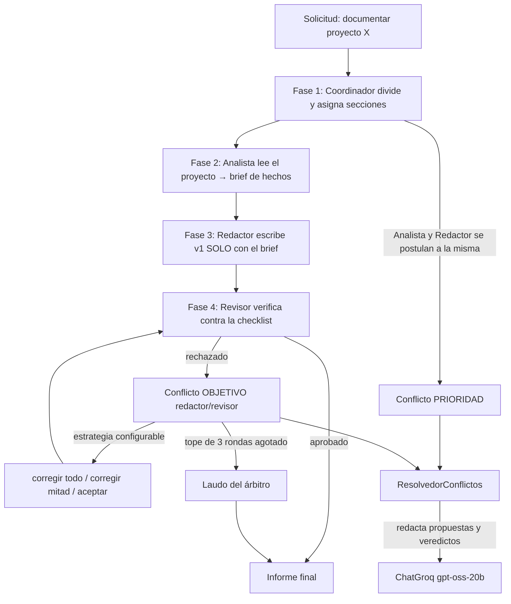

# Equipo multi-agente que produce un entregable — actividad IL2.3

Prototipo de **coordinación y resolución de conflictos entre varios agentes**,
elegido como *Proyecto 4 (Sistema de Colaboración Académica)* de la guía
pedagógica de IL2.3 «Planificación y Orquestación»
(`Ingenieria-de-Soluciones-con-IA/RA2/IL2.3/0-guia-pedagogica.md`), sobre la
base de los scripts `9-multi-agent-coordination.py` y
`10-conflict-resolution.py`.

## Qué hace

Cuatro agentes producen un **informe técnico real** de un proyecto:

- **Coordinador** — reparte las secciones por capacidad y media los conflictos.
- **Analista** — lee el proyecto (markdowns y árbol; código con `--codigo`) y
  arma un brief **solo con los hechos del material**.
- **Redactor** — escribe el informe con el brief y nada más.
- **Revisor** — verifica cada borrador contra una **checklist objetiva**
  (secciones exigidas, mínimo de palabras, sin placeholders, archivos citados
  verificables en el material) y aprueba o rechaza.

Cada rechazo abre un **conflicto real** entre Redactor y Revisor, que se
resuelve con seis estrategias configurables (`prioridad`, `negociacion`,
`arbitraje`, `votacion`, `compromiso`, `primero_en_llegada`), con tope duro de
3 rondas y laudo del árbitro. La salida es un informe en markdown, no una
conversación.

## Probar en 30 segundos

Requisitos: Python 3.11+ y los paquetes `langchain-groq`, `python-dotenv` y
`pytest`.

```bash
pip install langchain-groq python-dotenv pytest

python main.py                      # demo sobre el mini-proyecto incluido
python -m pytest tests -q           # 30 pruebas
```

El repo trae `ejemplo-proyecto/`, así que la demo corre **sin datos externos**.
El equipo LLM (ChatGroq, `openai/gpt-oss-20b`) es opcional: lee `GROQ_API_KEY`
de `.env` (ese archivo no se versiona) y, si no hay clave o hay un error de red
o de cuota, cada rol cae a su redactor determinista y la corrida se completa
igual. En este entorno la evidencia se generó con el intérprete del curso:

```powershell
& "..\ep1-ecoturismo-agente\.venv\Scripts\python.exe" main.py --proyecto ejemplo-proyecto --estrategia negociacion --seed 42
```

### Comandos

| Comando | Qué hace |
|---|---|
| `--proyecto OTRA_CARPETA [--codigo]` | documenta cualquier proyecto real; `--codigo` añade extractos `.py` |
| `--tema "un tema"` | crea `material/tema-<slug>/` con 2 notas md editables e informa sobre ellas |
| `--estrategia X --rondas N` | cambia cómo se resuelve el desacuerdo revisor/redactor (máx. 3 rondas) |
| `--breve` | consola reducida (fases, veredictos, métricas); el archivo guarda la transcripción íntegra |
| `--llm no` | determinista puro: sin red, sin clave, sin costo |
| `--comparar` | tabla comparativa de las 6 estrategias sobre el mismo borrador |

## Arquitectura



| Módulo | Rol |
|---|---|
| `simulacion/coordinacion.py` | adaptación de `9-multi-agent-coordination.py`: mensajes, capacidades, votación multi-opción |
| `simulacion/conflictos.py` | adaptación de `10-conflict-resolution.py`: detección y 6 estrategias |
| `simulacion/agentes.py` | `MiembroEquipo`: coordinación + recursos + deadline |
| `simulacion/escenario.py` | las 5 fases del trabajo en equipo, la checklist objetiva y las métricas |
| `simulacion/mediador_llm.py` | ChatGroq con roles acotados: analiza, redacta, revisa, arbitra |
| `main.py` | CLI (`--proyecto`, `--tema`, `--estrategia`, `--breve`, `--comparar`…) |
| `ejemplo-proyecto/`, `material/` | mini-proyecto para la demo y notas que genera `--tema` |
| `tests/`, `evidencia/` | 30 pruebas; transcripciones, comparativa e informes generados |

Mapeo de nombres base → proyecto: `MessageType/CoordinatedAgent/Coordinator` →
`TipoMensaje/AgenteCoordinado/Coordinador`; `ConflictType/ResolutionStrategy/
ConflictResolver` → `TipoConflicto/EstrategiaResolucion/ResolvedorConflictos`.

## Cómo se evitan las alucinaciones

1. El brief del Analista solo afirma lo que aparece en el material leído.
2. El Redactor recibe únicamente el brief y no puede citar archivos ausentes.
3. El Revisor no opina: el veredicto lo fija una **checklist determinista** y el
   LLM solo aporta motivos. En la primera corrida real este mecanismo detectó
   una cita no verificable (`biblioteca.json`, ausente del material) y la sacó
   del informe.

## Decisiones de diseño (errores de la guía que se evitan)

| Decisión | Error de la guía |
|---|---|
| Reparto por capacidades, checklist y estrategias en Python puro; los LLM solo producen contenido acotado (brief, borrador, motivos, laudo) | #1 no usar LLM para todo |
| Multi-agente justificado: dominios distintos (leer, escribir, verificar), conflictos reales y cada estrategia produce un informe diferente del mismo material | #4 no multi-agente sin propósito |
| Revisión máximo 3 rondas; al agotarse, el árbitro dicta resolución | #6 tope de iteraciones |
| Métricas por corrida (mensajes, conflictos, rondas, llamadas, tokens, segundos) y lectura con tope de caracteres por archivo | #5 medir el costo |
| `--seed` fija el `random` del desempate (el base usaba `random` global, no reproducible); políticas deterministas por rol | reproducibilidad |
| `votacion_multiple` vota entre N opciones con detección de empate; `arbitraje` y `primero_en_llegada` implementados (declarados pero ausentes en el base) | extensiones |

## Evidencia

Corrida real con equipo LLM sobre `ejemplo-proyecto/`
(`--estrategia negociacion --seed 42`, transcripción completa en
`evidencia/corrida-negociacion-seed42.md`):

| Métrica | Valor |
|---|---|
| Llamadas al equipo LLM | 12 (1 análisis + 3 redacciones + 3 revisiones + 5 propuestas) |
| Tokens (entrada / salida) | 5.393 / 2.960 (8.353 en total, reales del `usage` de Groq) |
| Mensajes intercambiados | 23 |
| Conflictos detectados / resueltos | 3 / 3 |
| Rondas de revisión | 2 rechazos → **APROBADO** en el 3.er veredicto |
| Segundos | 7,7 |

El Revisor rechazó dos veces por secciones bajo el mínimo de 60 palabras y el
Redactor corrigió hasta aprobar: el gate funcionó. El informe queda en
`evidencia/informe-ejemplo-proyecto.md`. Según cuántas rondas de corrección abra
el Revisor, una corrida completa cuesta entre 5 y 30 s y entre 6 y 11 mil
tokens. Una segunda corrida real, sobre un tema libre con estrategia arbitraje
(`evidencia/corrida-arbitraje-seed7.md` e `informe-tema-etica-en-el-uso-de-ia-en-la-evaluacion-universitaria.md`),
reprobó dos veces y aprobó en la ronda 3: 5.778 tokens, 5,1 s.

`python main.py --comparar` (misma semilla, sin equipo LLM, para aislar el
efecto de la estrategia sobre el mismo borrador):

| Estrategia | Rondas revisión | Aprobado | Acción del revisor | Conflictos | Rondas neg. |
|---|---|---|---|---|---|
| prioridad | 3 | no | corregir_todo ×3 | 4/4 | 0 |
| negociacion | 3 | no | corregir_mitad ×3 | 4/4 | 7 |
| arbitraje | 3 | no | corregir_todo ×3 | 4/4 | 0 |
| votacion | 1 | no | aceptar | 2/2 | 0 |
| compromiso | 3 | no | corregir_mitad ×3 | 4/4 | 0 |
| primero_en_llegada | 1 | no | aceptar | 2/2 | 0 |

Lectura: el escenario y el borrador son idénticos; lo que cambia es quién
impone su criterio y cuántas rondas cuesta. El Revisor es el gate de calidad
(prioridad 1): prioridad y arbitraje corrigen todo hasta agotar el tope;
compromiso y negociación corrigen la mitad; primero-en-llegada y votación
aceptan el borrador con fallos.

## Pruebas

```
$ python -m pytest tests -q
30 passed
```

Cubren el protocolo de mensajes, la votación multi-opción, las seis estrategias
(incluidas arbitraje y primero-en-llegada, ausentes del base), la checklist
(placeholders, archivos no verificables, mínimo de palabras), la lectura
acotada, la caída a determinista de cada rol LLM sin clave y los flags
`--tema` y `--breve`.

## Limitaciones conocidas

- Las prioridades y los deadlines los fija el escenario; un sistema real los
  derivaría de datos.
- La votación entre agentes usa sorteo con semilla; no modela persuasión.
- Sin `--codigo` solo se leen markdowns y árbol; los topes de lectura se
  eligieron para acotar el costo, no para capturar todo el contexto.
- Un archivo citado que no exista en el disco se rechaza aunque el README lo
  mencione: la regla es conservadora a propósito.
