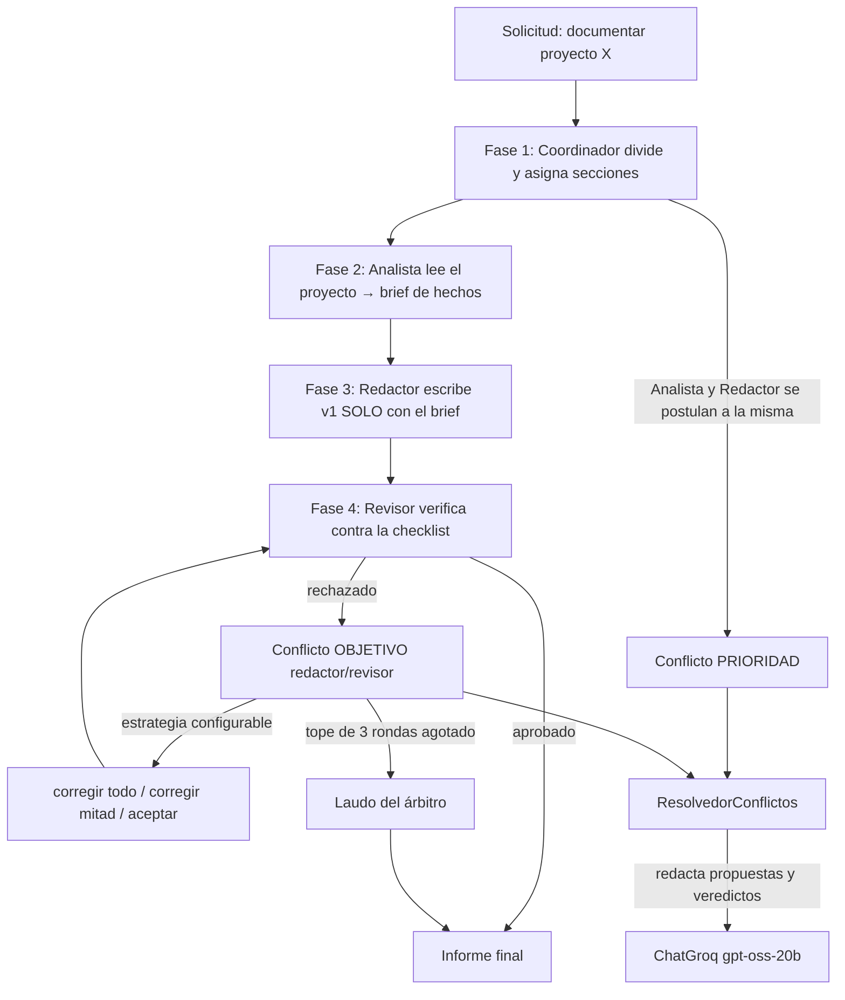

# Equipo multi-agente que produce un entregable — actividad IL2.3

Prototipo de **coordinación y resolución de conflictos entre varios agentes**,
elegido como *Proyecto 4 (Sistema de Colaboración Académica)* de la guía
pedagógica de IL2.3 «Planificación y Orquestación»
(`Ingenieria-de-Soluciones-con-IA/RA2/IL2.3/0-guia-pedagogica.md`).

Cuatro agentes **producen un informe técnico real de un proyecto**:

| Agente | Rol |
|---|---|
| **Coordinador** | divide el trabajo, asigna secciones por capacidad y media |
| **Analista** | lee el proyecto objetivo (markdowns, árbol, código opcional) y extrae un brief de hechos |
| **Redactor** | escribe el informe **usando solo el brief** (no puede alucinar) |
| **Revisor** | verifica cada borrador contra una checklist objetiva y aprueba o rechaza |

Cuando el revisor rechaza un borrador se abre un **conflicto real** entre
Redactor y Revisor que se resuelve con una de seis estrategias configurables
(`prioridad`, `negociacion`, `arbitraje`, `votacion`, `compromiso`,
`primero_en_llegada`), con tope duro de 3 rondas y laudo final del árbitro.
La salida es un informe en markdown, no una conversación.

## Demo en 30 segundos

El repo trae un mini-proyecto (`ejemplo-proyecto/`) para que la demo corra
sola, sin depender de datos externos:

```bash
python main.py                      # documenta ejemplo-proyecto/ con el equipo LLM real
python main.py --llm no             # misma corrida, determinista, sin red ni clave
```

## Requisitos y ejecución

- Python 3.11+, `langchain-groq`, `python-dotenv` y `pytest`.
- El proyecto se desarrolló con el intérprete del curso
  (`ep1-ecoturismo-agente/.venv`, Python 3.13); cualquier entorno con esos
  paquetes sirve.
- El equipo LLM usa ChatGroq (`openai/gpt-oss-20b` por defecto) y lee la clave
  de `.env` (`GROQ_API_KEY`, `GROQ_MODEL`). Ese archivo **no se versiona**
  (ver `.gitignore`). Sin clave, sin red o ante un error (p.ej. 429), cada rol
  cae a su redactor determinista y la corrida se completa igual: el modo usado
  queda registrado en las métricas.

```bash
# documenta cualquier proyecto real (por defecto solo lee .md y el árbol;
# --codigo añade extractos de .py, con tope de caracteres por archivo)
python main.py --proyecto ../ep1-veterinaria-agente --codigo

# la misma corrida con otra estrategia de resolución del desacuerdo
python main.py --proyecto ejemplo-proyecto --estrategia arbitraje --rondas 3

# informe sobre un tema libre: crea material/tema-<slug>/ con 2 notas md
# (edítalas y vuelve a correr; el contenido de esas notas manda)
python main.py --tema "Etica en el uso de IA en la evaluacion universitaria"

# consola reducida: fases, veredictos y métricas (21 líneas en vez de 100+);
# la transcripción completa sigue íntegra en evidencia/corrida-*.md
python main.py --proyecto ejemplo-proyecto --breve

# tabla comparativa de las 6 estrategias sobre el MISMO borrador (determinista)
python main.py --comparar

# pruebas del protocolo (30 pruebas)
python -m pytest tests -q
```

Comando exacto usado para la evidencia de este repositorio (Windows):

```
& "..\ep1-ecoturismo-agente\.venv\Scripts\python.exe" main.py --proyecto ejemplo-proyecto --estrategia negociacion --seed 42
```

## Arquitectura



| Módulo | Rol |
|---|---|
| `simulacion/coordinacion.py` | adaptación de `9-multi-agent-coordination.py`: mensajes, capacidades, votación multi-opción |
| `simulacion/conflictos.py` | adaptación de `10-conflict-resolution.py`: detección y 6 estrategias de resolución |
| `simulacion/agentes.py` | `MiembroEquipo`: une ambos mundos (coordinación + recursos + deadline) |
| `simulacion/escenario.py` | las 5 fases del trabajo en equipo, la checklist objetiva y las métricas |
| `simulacion/mediador_llm.py` | ChatGroq con roles acotados: analiza, redacta, revisa, arbitra |
| `main.py` | CLI: `--proyecto`, `--tema`, `--estrategia`, `--rondas`, `--breve`, `--codigo`, `--comparar` |
| `ejemplo-proyecto/` | mini-proyecto autocontenido para la demo |
| `material/` | carpetas `tema-<slug>/` que genera `--tema` (notas editables) |
| `tests/` | 30 pruebas del protocolo (coordinación, conflictos, escenario, mediador, CLI) |
| `evidencia/` | transcripción y métricas por estrategia, comparativa e informe generado |

Mapeo de nombres base → proyecto: `MessageType/CoordinatedAgent/Coordinator`
→ `TipoMensaje/AgenteCoordinado/Coordinador`; `ConflictType/ResolutionStrategy/
ConflictResolver` → `TipoConflicto/EstrategiaResolucion/ResolvedorConflictos`.

## Cómo se evitan las alucinaciones

1. El **Analista** solo puede afirmar lo que aparece en el material entregado;
   el brief se arma a partir de los archivos realmente leídos.
2. El **Redactor** recibe únicamente el brief y tiene prohibido citar archivos
   que no estén en él.
3. El **Revisor** no "opina": evalúa el borrador con una **checklist
   determinista** (las 4 secciones exigidas, mínimo de palabras por sección,
   sin placeholders, archivos citados verificables en el material). El LLM
   aporta motivos y correcciones puntuales, pero el veredicto
   `aprobado/rechazado` lo fija la checklist. En la primera corrida real este
   mecanismo detectó una cita no verificable (`biblioteca.json`, ausente del
   material leído) y la obligó a salir del informe.

## Decisiones de diseño (y errores de la guía que se evitan)

1. **No usar LLM para todo** (error #1). El reparto por capacidades, la
   checklist y las seis estrategias de resolución son Python puro. Los LLM solo
   producen contenido acotado (brief, borrador, motivos, laudo); quién gana
   cada conflicto lo decide el protocolo.
2. **Sí se justifica el multi-agente** (error #4). No son agentes pasándose
   texto en línea: los roles tienen dominios distintos (leer, escribir,
   verificar), el rechazo del revisor abre un conflicto real con términos
   negociables y cada estrategia produce un informe *diferente* a partir del
   mismo material.
3. **Tope duro de iteraciones** (error #6). La revisión corre como máximo 3
   rondas; al agotarse, el árbitro dicta resolución y el informe se consolida
   de todas formas.
4. **Medir tokens y segundos** (error #5). Cada corrida reporta mensajes,
   conflictos por tipo, rondas de revisión y de negociación, llamadas y tokens
   del equipo LLM y segundos totales. La lectura de archivos tiene tope de
   caracteres por archivo (`--codigo` cuesta más y es opt-in).
5. **Reproducibilidad.** `--seed` fija el `random` del desempate por votación
   (el archivo base usaba `random` global, por lo que sus corridas no eran
   reproducibles). Las políticas de cada miembro son deterministas por rol.
6. **Extensiones sobre los archivos base.** `votacion_multiple` vota entre N
   opciones y detecta empates (el base solo votaba sí/no);
   `resolver_por_arbitraje` y `resolver_primero_en_llegar` están declarados en
   el enum del base pero sin implementación, aquí sí funcionan con criterio
   explícito (deadline más próximo / orden de llegada).

## Evidencia

Corrida real con equipo LLM (`python main.py --proyecto ejemplo-proyecto
--estrategia negociacion --seed 42`), proyecto de ejemplo:

| Métrica | Valor |
|---|---|
| Llamadas al equipo LLM | 12 (1 análisis + 3 redacciones + 3 revisiones + 5 propuestas de negociación) |
| Tokens (entrada / salida) | 5.393 / 2.960 (8.353 en total) |
| Mensajes intercambiados | 23 |
| Conflictos detectados / resueltos | 3 / 3 (reparto + 2 de revisión) |
| Rondas de revisión | 2 rechazos → **APROBADO** en el 3.er veredicto |
| Segundos | 7,7 |

(`tokens_estimados: false`: los tokens vienen del `usage` de Groq, no de una
estimación.) El revisor rechazó dos veces (una sección con menos de 60
palabras, 53 en otra) y el redactor corrigió hasta aprobar: el gate de calidad
funcionó y el informe final quedó en `evidencia/informe-ejemplo-proyecto.md`.
El costo de una corrida completa varía con el día: entre 5 y 30 s y entre 6 y
11 mil tokens, según cuántas rondas de corrección abra el revisor.

Una segunda corrida real, ahora sobre un **tema libre**
(`--tema "Etica en el uso de IA en la evaluacion universitaria"`, estrategia
arbitraje, semilla 7), quedó en `evidencia/corrida-arbitraje-seed7.md`: el
Revisor rechazó dos veces por secciones bajo el mínimo de palabras y aprobó en
la ronda 3; 2 chats de arbitraje, 5.778 tokens, 5,1 s. El informe resultante
está en `evidencia/informe-tema-etica-en-el-uso-de-ia-en-la-evaluacion-universitaria.md`.
Con `--breve` esa corrida ocupa 21 líneas de consola en lugar de más de 100.

`python main.py --comparar` (misma semilla, sin equipo LLM, para aislar el
efecto de la estrategia sobre el MISMO borrador):

| Estrategia | Rondas revisión | Aprobado | Acciones del revisor | Conflictos | Rondas neg. |
|---|---|---|---|---|---|
| prioridad | 3 | no | corregir_todo ×3 | 4/4 | 0 |
| negociacion | 3 | no | corregir_mitad ×3 | 4/4 | 7 |
| arbitraje | 3 | no | corregir_todo ×3 | 4/4 | 0 |
| votacion | 1 | no | aceptar | 2/2 | 0 |
| compromiso | 3 | no | corregir_mitad ×3 | 4/4 | 0 |
| primero_en_llegada | 1 | no | aceptar | 2/2 | 0 |

Lectura: el escenario y el borrador son idénticos entre estrategias; lo que
cambia es la acción que toma el equipo cuando el revisor rechaza. El Revisor es
el gate de calidad (prioridad 1): las estrategias por prioridad y arbitraje le
dan la razón y el Redactor corrige todo hasta agotar el tope; el compromiso y
la negociación corrigen la mitad de los puntos; primero-en-llegada deja ganar
al Redactor (llegó primero) y acepta el borrador con fallos; la votación
depende del sorteo con semilla. Ninguna estrategia cambia los hechos: decide
quién impone su criterio y cuántas rondas cuesta.

Archivos en `evidencia/`: transcripción y métricas por estrategia
(`corrida-<estrategia>-seed42.md`), la tabla comparativa
(`comparativa-estrategias.md`) e **informe final generado por el equipo**
(`informe-ejemplo-proyecto.md`).

## Pruebas

```
$ python -m pytest tests -q
30 passed
```

Cubren: broadcast y procesamiento de mensajes, votación multi-opción con
detección de empate, asignación por capacidad, las seis estrategias de
resolución (incluidos arbitraje y primero-en-llegada, ausentes del base),
reproducibilidad por semilla, tope de 3 rondas con laudo del árbitro, la
checklist (placeholders, archivos no verificables, mínimo de palabras), la
lectura acotada del proyecto, la caída a determinista de cada rol LLM sin
clave, y el CLI nuevo: el scaffold de `--tema` (crea dos notas y respeta las
editadas) y el filtro de `--breve` (consola esencial, registro completo).

## Limitaciones conocidas

- Las prioridades y los deadlines los fija el escenario; un sistema real los
  derivaría de datos (urgencia real del trabajo).
- La votación entre agentes usa sorteo con semilla; no modela persuasión.
- El brief se construye sobre markdowns y árbol; sin `--codigo` no se leen los
  fuentes. Los topes de lectura se eligieron para mantener el costo acotado,
  no para capturar todo el contexto posible.
- Un archivo citado que no exista en el disco se rechaza aunque el README lo
  mencione como parte del diseño: la regla es conservadora a propósito
  (mejor un reclamo falso que una alucinación aceptada).
